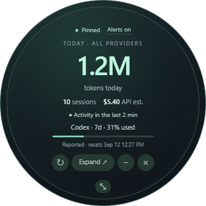

# AI Companion

A local desktop companion for **Codex and Claude**. Keep an eye on usage, recent activity, and chats that need your input with a resizable circular widget.

Independent community software; not affiliated with OpenAI or Anthropic.

The desktop app now uses **Rust + Tauri 2**. Rust reads local histories, calculates usage, watches files, exports CSV, and manages the dashboard and circular widget. The existing React interface runs in the Windows system WebView2. The packaged app requires neither Electron nor Node.js.



[See the full dashboard with sample data](docs/images/dashboard.png).

## Download

Build the Rust version using the instructions below. Existing v1.0.0 release downloads predate this migration and use Electron.

- **Standalone executable:** `src-tauri/target/release/ai-companion.exe`.
- **Installer:** `npm run dist:win` creates an NSIS installer in `src-tauri/target/release/bundle/nsis/`.
- Windows 11 is the target platform. WebView2 is required; the installer can install it when missing.

## What it does

- Combined and separate Codex / Claude usage dashboards: tokens, sessions, projects, activity, and estimated API-equivalent costs.
- A circular, always-on-top mini widget. Drag its background to move it; drag the bottom grip to resize. Size, position, and pin preferences persist across launches.
- Local session history, project privacy controls, charts, cache insights, and CSV / clipboard exports.
- A Now / Then layout: the left pane always shows Claude and Codex allowance dials, today's totals, and chats waiting on you; the right pane holds Today, Projects, History and Insights.
- The round widget draws both allowances as arcs on its ring and pulses at newly reported 80% and 95% crossings.
- Blue pulses for new, explicit unanswered questions or approval requests in an active chat turn.

**Mini** opens the widget. **Expand** restores the dashboard. **Alerts on/off** controls pulses; reduced-motion settings are respected. Hover a chat notice to see its project, or click to dismiss the notice without answering the chat.

## Chat alerts: deliberately conservative

Supported signals are Codex `request_user_input` / `request_user_input_async` and Claude `AskUserQuestion` / `ExitPlanMode` tool calls in local transcripts.

A request must first appear while the app is running, be less than two minutes old when discovered, and remain unanswered for three seconds. Recorded replies, tool results, completion, cancellation, and a ten-minute expiry clear it. Existing startup requests, archived/background sessions, ordinary final answers, and inactivity alone do not generate notifications.

This depends on the client's log format. Plain-text questions, generic permission dialogs, and tools hidden inside execution wrappers are not inferred. A silently closed chat cannot be identified if its client writes no close/cancel event. AI Companion never submits answers or approvals.

## Local data and privacy

No account login or API key is required. The app reads local files and does not upload chat histories or usage data.

The one outbound request is the Claude allowance check. Every five minutes the Rust side reads the OAuth access token Claude Code keeps in `~/.claude/.credentials.json` and asks Anthropic's usage endpoint (the same data `/usage` shows) for the 5-hour and 7-day figures. The token stays in the Rust process, the refresh token is never read, and the app never signs in or renews a session itself. Switch the check off with the **Live check** toggle on the Claude allowance panel; the preference is `claude-limits` in `renderer-preferences.json`. With the check off, or when Claude Code is signed out, the panel falls back to the newest rate-limit notice recorded in a local transcript, if any.

| Provider | Sources |
| --- | --- |
| Codex | `$CODEX_HOME/sessions` and `archived_sessions`, defaulting to `~/.codex` |
| Claude | `~/.claude/projects`, `sessions`, `history.jsonl`, optional aggregate stats cache, and available Desktop session metadata |

Conversation message bodies are not sent to the dashboard renderer. Local project names, session identifiers, branch names, and session slugs may be displayed; use project privacy controls before sharing screenshots or exports.

Missing transcripts remain missing: metadata-only history can contribute session dates and project counts, but unknown usage is never invented. Older aggregate snapshots are displayed separately because their overlap cannot be reconciled reliably.

App preferences live in the operating system's per-user `ai-companion` application-data directory. Existing window bounds and pin/mini settings are reused. Privacy and alert settings persist in `renderer-preferences.json`; the renderer loads these before displaying any projects. The original Electron profile is left intact.

When migrating another Electron source checkout, close the old dashboard and run `.\node_modules\electron\dist\electron.exe scripts\export-electron-preferences.cjs` **before** `npm ci` removes Electron. This exports hidden-project and alert settings without overwriting an existing Rust preference file. The helper is only for migration; it does not ship in the Rust app.

## Understanding the numbers

Dollar values are estimates at known standard API rates, **not subscription charges**. Unknown model prices are excluded. Pricing can become outdated; rates are maintained in `src-tauri/src/pricing.rs`.

Codex allowance values are the last locally recorded snapshots, not live account queries. Claude allowance values come from the live check described above, or from a transcript limit notice when the check is unavailable. Cloud activity without local records is not included. Cached input and reasoning counts are normalized to avoid double counting.

Active time and context-health scores are heuristics. Recent activity means a message was recorded in the last two minutes; it does not prove a model is still running.

## Run from source

Building requires Node.js 22 or later, npm, stable Rust with the MSVC toolchain, Microsoft C++ Build Tools (Desktop development with C++), and WebView2. See [Tauri's Windows prerequisites](https://v2.tauri.app/start/prerequisites/). Node and Rust are development dependencies only.

```sh
npm ci
npm run build
npm start
```

For development: `npm run dev`. On Windows, `start-dashboard.bat` launches the release executable, building it first if missing. After source changes run `npm run build` again. `create-shortcut.ps1` creates a source-checkout shortcut using the current folder.

## Build and test

```sh
npm run typecheck
npm test
npm run test:parity
npm run build
npm run dist:win
```

`npm test` runs the original parser regression suite, Rust history/cache integration tests, and the parity suite. `test:parity` runs the parity suite on its own: it compares Rust with the original implementation on synthetic parser, aggregate, CSV privacy, and alert fixtures. `tests/reference/` contains the old TypeScript data implementation solely as a regression oracle; none of it ships in the app. The former Electron UI automation scripts have been removed. Generated screenshots and local histories are excluded from Git.

Run these checks locally before publishing release artifacts. Automated GitHub Actions builds are not enabled for this release.

## License

ISC. See [LICENSE](LICENSE).
